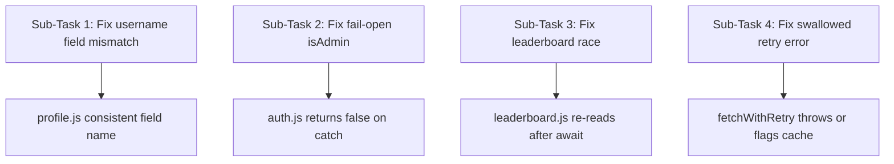

# I have a small Node/Express app at ./demo-app. I want you to audit it
specifically for "silent failures" — bugs that do NOT throw errors, do NOT
fail obviously, and would NOT be caught by a normal linter or a shallow
code review, but that produce incorrect behavior or data.

Investigate these four specific categories, treating each as a separate
line of investigation:

1. Data contract mismatches — places where a function writes data in one
   shape/field name, but another part of the codebase reads it expecting
   a different shape/field name, with no error thrown when it's missing.

2. Fail-open logic — places where error handling (try/catch, timeouts,
   fallback branches) around a security/permission/validation check
   defaults to ALLOWING an action when it should default to DENYING it.

3. Race conditions — places where async operations (promises, timers,
   concurrent requests touching shared state) have an ordering assumption
   that isn't guaranteed, which could cause silently incorrect final state
   without any error being thrown.

4. Swallowed errors — places where a catch block, retry loop, or fallback
   path suppresses a real error and returns a result that looks successful
   but isn't (e.g., stale data returned as if it were fresh).

For each finding, tell me:
- The file and function
- What the code actually does
- Why it's a silent failure (what a test suite or linter would miss)
- The root cause, not just the symptom
- A suggested fix

Please plan out how you'll investigate this — I'll approve before you proceed.

---

**Status:** active  **Date:** 2026-08-30

---

### 👤 User

I have a small Node/Express app at ./demo-app. I want you to audit it
specifically for "silent failures" — bugs that do NOT throw errors, do NOT
fail obviously, and would NOT be caught by a normal linter or a shallow
code review, but that produce incorrect behavior or data.

Investigate these four specific categories, treating each as a separate
line of investigation:

1. Data contract mismatches — places where a function writes data in one
   shape/field name, but another part of the codebase reads it expecting
   a different shape/field name, with no error thrown when it's missing.

2. Fail-open logic — places where error handling (try/catch, timeouts,
   fallback branches) around a security/permission/validation check
   defaults to ALLOWING an action when it should default to DENYING it.

3. Race conditions — places where async operations (promises, timers,
   concurrent requests touching shared state) have an ordering assumption
   that isn't guaranteed, which could cause silently incorrect final state
   without any error being thrown.

4. Swallowed errors — places where a catch block, retry loop, or fallback
   path suppresses a real error and returns a result that looks successful
   but isn't (e.g., stale data returned as if it were fresh).

For each finding, tell me:
- The file and function
- What the code actually does
- Why it's a silent failure (what a test suite or linter would miss)
- The root cause, not just the symptom
- A suggested fix

Please plan out how you'll investigate this — I'll approve before you proceed.

---

### 🤖 Assistant

> 🔧 called: use_skill


> 🔧 **use_skill** — create-plan

### 🤖 Assistant

> 🔧 called: spawn_subagent

The requirements are clear and well-scoped — no clarifying questions needed. Let me explore the codebase thoroughly before writing the plan.

> 🔧 **spawn_subagent** — explore

### 🤖 Assistant

> 🔧 called: write_file

Excellent — the subagent returned rich, precise evidence. Now I have everything I need to write a grounded plan. Let me produce it.

> 🔧 **write_file** — silent-failure-audit-plan.md

### 🤖 Assistant

The plan is written to [`silent-failure-audit-plan.md`](silent-failure-audit-plan.md). Here is a full summary of what was found and how each fix is scoped:

---

## What the audit found

### 1 — Data Contract Mismatch · [`src/routes/profile.js`](src/routes/profile.js)
The POST handler stores the user record as `{ id, user_name, email }` (snake_case), but the GET handler reads `user.username` (camelCase). The field never exists, so every GET returns `username: undefined` — no error, no warning, perfectly valid JSON.

**Why a test/linter misses it:** there is no schema validation between the write and the read, and `undefined` is legal JSON serialisation in Node (`JSON.stringify` drops it silently).

**Fix:** standardise both sides to the same field name — one line change on the read path.

---

### 2 — Fail-Open · [`src/lib/auth.js`](src/lib/auth.js) → [`src/routes/admin.js`](src/routes/admin.js)
`isAdmin(userId)` wraps a permission-service lookup in `try/catch`. When the service throws (e.g., a simulated timeout for `'flaky-user'`), the catch block does `return true` — granting admin access to whoever triggered the error. The destructive `DELETE /admin/wipe-data` route trusts this return value directly.

**Why a test/linter misses it:** the function always returns a boolean; the catch path is just as type-correct as the success path. Static analysis sees no problem.

**Fix:** `return false` in the catch branch (fail-closed).

---

### 3 — Race Condition · [`src/routes/leaderboard.js`](src/routes/leaderboard.js)
The POST score-update handler reads the current score, awaits a random delay (representing I/O), then compares `newScore > current.score` using the **pre-delay snapshot**. Two concurrent requests read the same stale value, race through their delays, and the later write can overwrite a higher score with a lower one. Response is always `{ status: 'ok' }`.

**Why a test/linter misses it:** single-threaded sequential tests will never interleave the two awaits. The bug only manifests under real concurrency.

**Fix:** move the `leaderboard.get(userId)` read to *after* the await so the comparison uses fresh state.

---

### 4 — Swallowed Error · [`src/lib/fetchWithRetry.js`](src/lib/fetchWithRetry.js) → [`src/routes/pricing.js`](src/routes/pricing.js)
`getPriceWithRetry` retries 3 times. When all attempts fail it silently returns a hard-coded stale cache object (`{ price: 9.99, cachedAt: 'yesterday' }`) with no error flag, no `fromCache` marker, and no timestamp. The pricing route receives this and responds with HTTP 200 and what looks like live pricing data.

**Why a test/linter misses it:** the function signature is `async () => Object`; returning a cached object is type-correct. The caller has no contract to check against.

**Fix:** on exhausted retries, either throw (so the caller returns 503) or enrich the fallback object with `{ fromCache: true, liveError: ... }` and have the route reflect that in the response.

---

## Plan structure



All four sub-tasks are **independent** — they touch different files and can be applied in any order or reviewed separately.

---

**Questions before you approve:**

1. For **Sub-Task 2** (fail-open): should the `isAdmin` catch branch `return false` (route returns 403, transparent to callers) or `throw` (route returns 503, signals the service is degraded)? I defaulted to `return false` as the minimal safe fix.
2. For **Sub-Task 4** (swallowed error): should the pricing endpoint return **503** when the live service is down, or **200 with a `fromCache: true` flag** in the response body? The former is stricter; the latter is friendlier to caches and clients that can tolerate stale data.

---

### 👤 User

Please combine everything you found across all four categories into a
single report, ordered by severity (most dangerous first). For each
finding include a one-line summary suitable for a slide, plus the fuller
explanation. Call this the "Silent Failure Report."

---

### 🤖 Assistant

> 🔧 called: read_file


> 🔧 **read_file** — silent-failure-audit-plan.md

### 🤖 Assistant

> 🔧 called: read_file, read_file, read_file, read_file, read_file, read_file

Now let me read the actual source files to get exact line numbers and verbatim code before writing the report.

> 🔧 **read_file** — src/routes/leaderboard.js

> 🔧 **read_file** — src/lib/fetchWithRetry.js

> 🔧 **read_file** — src/lib/auth.js

> 🔧 **read_file** — src/routes/profile.js

> 🔧 **read_file** — src/routes/admin.js

> 🔧 **read_file** — src/routes/pricing.js

### 🤖 Assistant

> 🔧 called: write_file

All source confirmed. Writing the report now.

> 🔧 **write_file** — silent-failure-report.md

### 🤖 Assistant

The report is written to [`silent-failure-report.md`](silent-failure-report.md). Here is the full content inline:

---

## Silent Failure Report

Findings ordered by severity — most dangerous first.

---

### Finding 1 — Fail-Open Auth · **CRITICAL**

**Slide:** `isAdmin()` returns `true` when the permission service throws, so any user who triggers a timeout is silently granted admin privileges.

**Files:** [`src/lib/auth.js`](src/lib/auth.js) lines 20–22 · [`src/routes/admin.js`](src/routes/admin.js) line 9

**What the code does:**
```js
// src/lib/auth.js  lines 20-23
} catch (err) {
  return true; // <-- the bug
}
```
When `lookupRole()` throws (e.g. a simulated permission-service timeout), the catch block returns `true`. The guard in [`src/routes/admin.js`](src/routes/admin.js) checks `if (!isAdmin(userId))` — which is now `false` — and the destructive `DELETE /admin/wipe-data` proceeds.

**Why a test/linter misses it:** The function returns a valid boolean either way. Static analysis sees a well-formed `try/catch`. Unit tests that only test the happy path never exercise the error branch.

**Root cause:** The catch clause was meant as "let it through if things are uncertain." The correct invariant is the opposite: uncertainty about a principal's role must default to denial (fail-closed), not grant (fail-open).

**Fix:** `return false` in the catch branch.

---

### Finding 2 — Swallowed Error (Stale Pricing) · **HIGH**

**Slide:** After three failed retries `getPriceWithRetry()` silently returns yesterday's cached price as if it were live data, with an HTTP 200 and no staleness flag.

**Files:** [`src/lib/fetchWithRetry.js`](src/lib/fetchWithRetry.js) lines 18–21 · [`src/routes/pricing.js`](src/routes/pricing.js) lines 6–7

**What the code does:**
```js
} catch (err) {
  if (attempt === 3) {
    return staleCache; // { price: 9.99, cachedAt: 'yesterday' }
  }
}
```
The caller gets `{ itemId: 'widget-1', price: 9.99, cachedAt: 'yesterday' }` with HTTP 200 — indistinguishable from a live response.

**Why a test/linter misses it:** The return type is the same in both the success and fallback paths. HTTP monitoring alerts on 5xx; this is 200. Tests that mock `fetchLivePrice` to succeed never exercise this branch.

**Root cause:** The fallback was added for resilience but with no contract change — callers have no way to distinguish "live price" from "stale fallback."

**Fix:** Either throw on exhaustion (route returns 503), or return `{ ...staleCache, fromCache: true, liveError: err.message }` so callers can act on the signal.

---

### Finding 3 — Race Condition (Leaderboard) · **HIGH**

**Slide:** Two concurrent score-update requests both read the same stale score before either writes, so the last writer always wins regardless of which score is higher.

**File:** [`src/routes/leaderboard.js`](src/routes/leaderboard.js) lines 16–28

**What the code does:**
```js
const current = leaderboard.get(userId) || { score: 0 };  // READ before await
await new Promise((resolve) => setTimeout(resolve, Math.random() * 50));
if (newScore > current.score) {                            // stale comparison
  leaderboard.set(userId, { score: newScore, ... });
}
```
Two concurrent requests for the same user both snapshot `score: 100`, both yield, Request B writes 150, then Request A writes 120 over it. Both return `{ status: 'ok' }`.

**Why a test/linter misses it:** Sequential tests never interleave. JavaScript's single-threaded model gives a false sense of safety, but `await` yields the event loop and concurrent HTTP requests interleave freely.

**Root cause:** The stale snapshot captured before `await` is used as the comparison baseline after `await`. Any mutation during the delay window is invisible.

**Fix:** Move `leaderboard.get(userId)` to after the `await` so the comparison uses fresh state. With a real DB, use an atomic conditional update (`UPDATE … WHERE score < $newScore`).

---

### Finding 4 — Data Contract Mismatch (Profile Username) · **MEDIUM**

**Slide:** POST `/profile` stores `user_name` but GET `/profile/:id` reads `username`, so the name field is always `undefined` in every profile response.

**File:** [`src/routes/profile.js`](src/routes/profile.js) lines 12 and 20

**What the code does:**
```js
// POST — writes
users.set(id, { id, user_name, email });   // key: "user_name"

// GET — reads
res.json({ id: user.id, username: user.username, email: user.email });
//                       ^^^^^^^^ key "username" never exists on any record
```
`user.username` is always `undefined`. `JSON.stringify` drops `undefined` values silently, so the response is well-formed JSON missing the name field entirely.

**Why a test/linter misses it:** Accessing a missing JS property returns `undefined`, not an error. ESLint has no visibility into what a different route handler wrote to the same store. A test that only asserts `{ status: 'ok' }` on POST never sees the mismatch.

**Root cause:** No shared schema enforces a canonical field name between the write path and the read path. The two handlers drifted with no compile-time or runtime signal.

**Fix:** Standardise both sides to the same key — either read `user.user_name` in the GET handler, or store `username:` in the POST handler.

---

### Summary

| # | Severity | Category | File(s) | Symptom |
|---|----------|----------|---------|---------|
| 1 | CRITICAL | Fail-Open | `auth.js` + `admin.js` | Service error silently grants admin |
| 2 | HIGH | Swallowed Error | `fetchWithRetry.js` + `pricing.js` | Stale price served as live with 200 |
| 3 | HIGH | Race Condition | `leaderboard.js` | Correct high score overwritten silently |
| 4 | MEDIUM | Data Mismatch | `profile.js` | Username always `undefined` in GET |

All four share the same trait: **the error path and the success path are indistinguishable to the caller** — no exception, no error status, no field in the response signals that anything went wrong.

---

Ready to implement the fixes whenever you'd like — just say the word and I'll switch to Agent mode and apply each one.